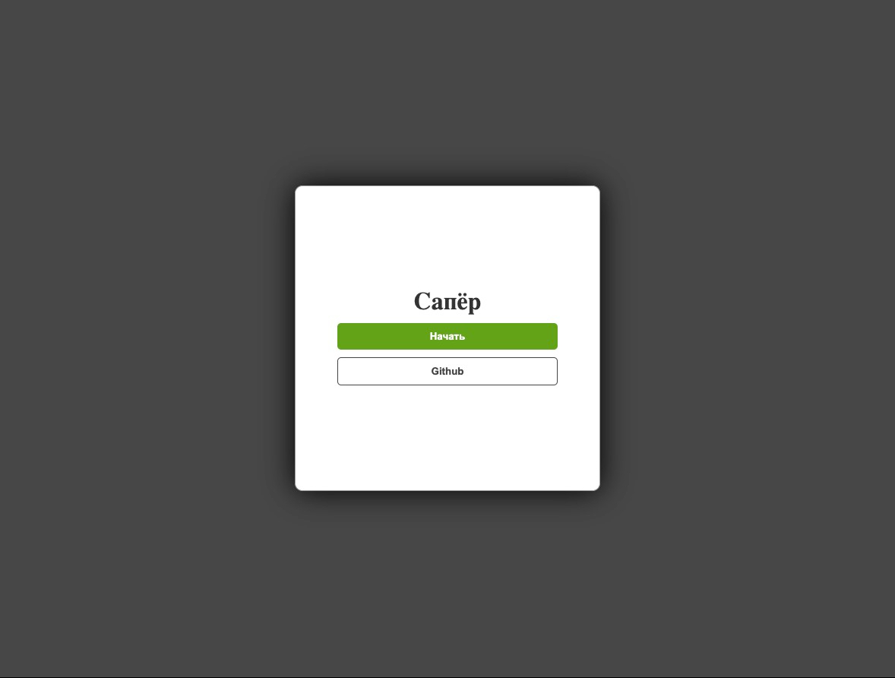
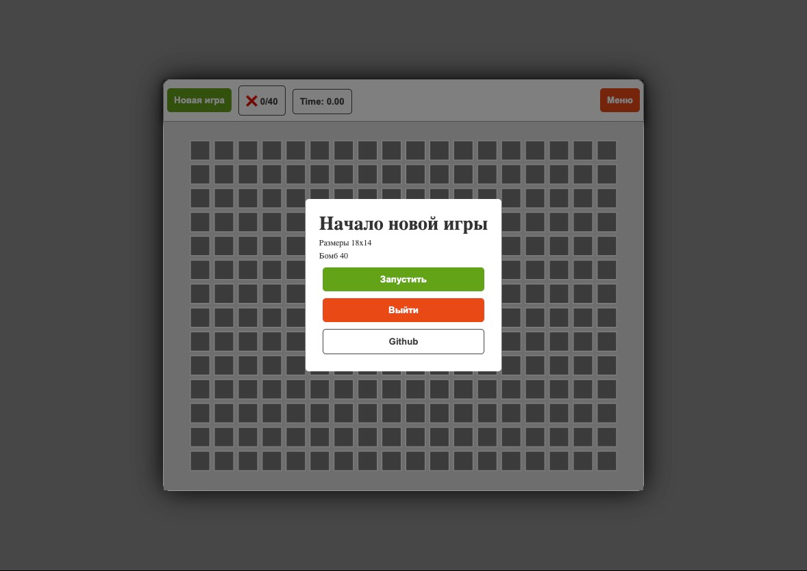
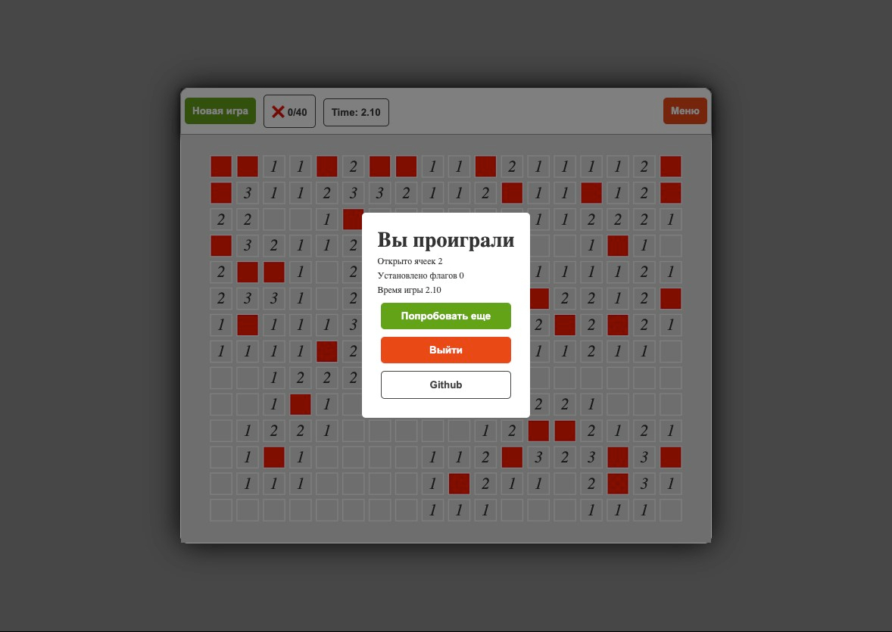

# Сапёр на TypeScript/React

### Для запуска
```bash
> npm install
> npx webpack serve
```

### Для сборки
```bash
> npm install
> npx webpack
```

### Онлайн версия

Расположена [тут](https://vicimpa.github.io/minesweeper)

### Скриншоты

> 
>
> 
>
> 
>
> 
>